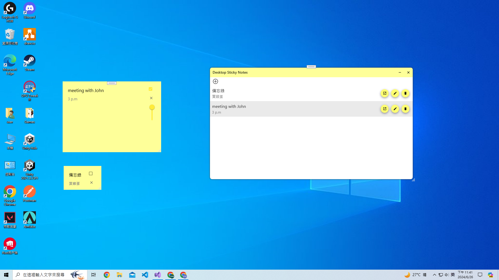

# 桌面便條紙 Windows Desktop Notes

這是一個桌面便條紙應用程式，可以在電腦螢幕上貼上便條紙並讓他們保持在畫面最上方，即使切換視窗也不會蓋過這些便條紙。

This is a desktop sticky notes app. You can place sticky notes anywhere on your screen, and they will remain visible even when you switch windows.

### 功能 Features

✅	新增 / 編輯 / 刪除便條紙 &nbsp;&nbsp;&nbsp; add / edit / delete sticky note

✅ 將便條紙貼在螢幕上 &nbsp;&nbsp;&nbsp; paste sticky note on the screen

✅ 縮放便條紙 / 鎖定便條紙 / 調整透明度 &nbsp;&nbsp;&nbsp; scale note / lock note / modify note's opacity

⬜ 隱藏便條紙工具列 &nbsp;&nbsp;&nbsp; show / hide note's toolbar.

### 使用方式 Usage

- 將專案clone回本機 Clone this repo

	執行 `git clone https://github.com/HongGers/desktop-notes.git`

	Run `git clone https://github.com/HongGers/desktop-notes.git`

- 建置 Build

	用 IDE 打開該專案後建置並執行

	Open this project with your IDE, then build and run it.